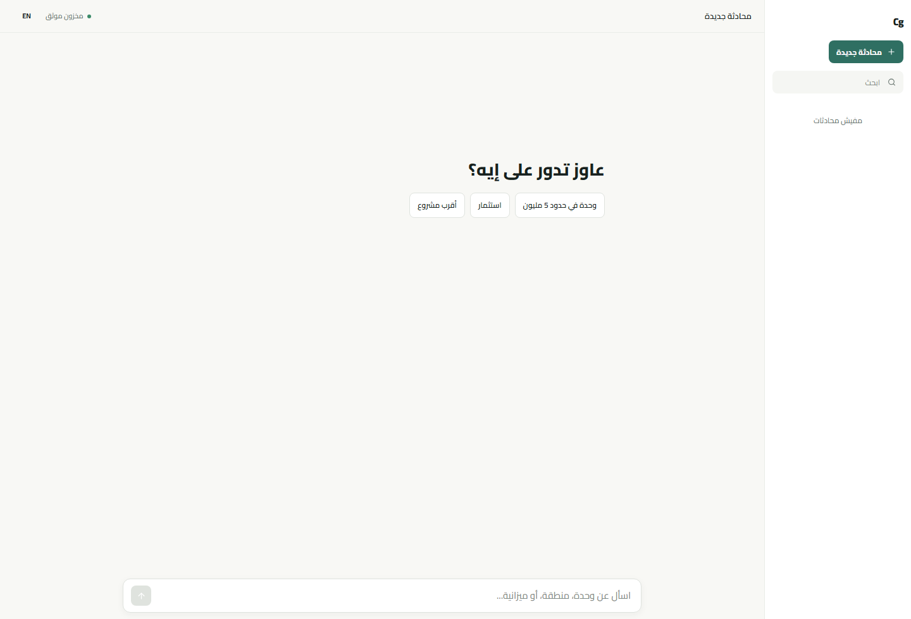
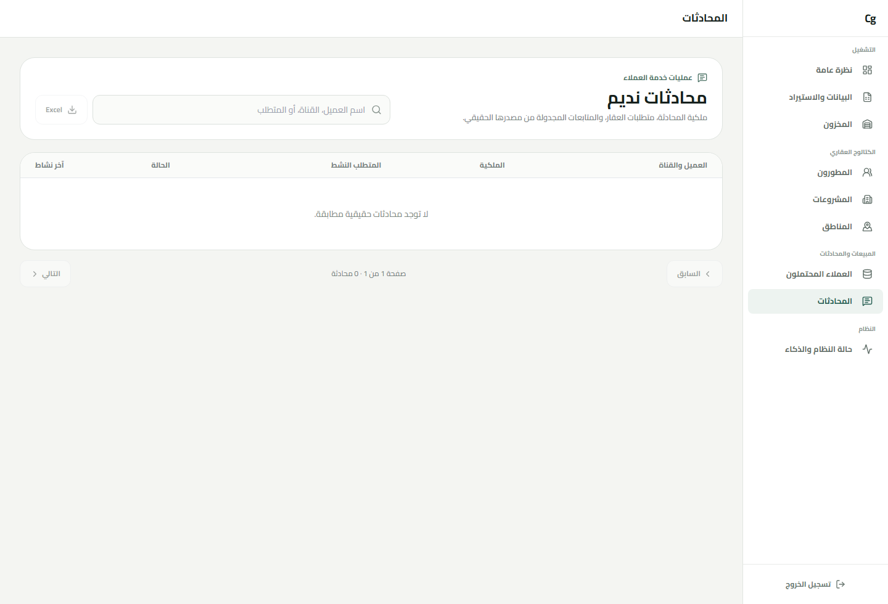

# Maqar / مَقار

Arabic-first, AI-powered real-estate customer service grounded in verified inventory.

## Live Demo / GitHub

[GitHub](https://github.com/popwam/cg-ai)

## Screenshots

| Nadim Web conversation | Customer-service Dashboard |
| --- | --- |
|  |  |

## Key Features

- AI-first real-estate customer service with Nadim
- Verified inventory search
- Multi-requirement customer lifecycle
- WhatsApp + Web conversation continuity
- Human handoff
- Secure conversation sharing
- Scheduled follow-ups
- Deterministic truth and action safety

## Tech Stack

Next.js · NestJS · Prisma · PostgreSQL · n8n · Evolution API / WhatsApp · AWS Bedrock GLM + Groq

## Architecture

- `apps/web` — Next.js customer chat + protected Admin workspace.
- `apps/api` — NestJS chat orchestration, inventory/search, imports, project structure, maps, storage and AI routing.
- `packages/database` — Prisma/PostgreSQL schema and forward-only migrations.
- Neon/PostgreSQL — canonical structured data and conversation state.
- R2 — imported source workbooks and approved assets.
- Google Maps / Places / Routes — verified geography and routing.

Internal npm workspace names still use the legacy `@maqar/*` package identifiers for compatibility; this is not user-facing branding.

## Real-estate hierarchy

The editing/search model is now:

```text
Developer
  → Project
    → Phase / Community
      → Building
        → Unit
```

Project values act as defaults. A phase can override delivery, finishing, unit mix, market and payment information; a specific unit can carry its own final override where needed.

## Admin workspace

The project editor uses tabs instead of one long form:

- Overview
- Phases
- Market
- Media
- Payments
- Boundary
- Master Plan
- Knowledge

Inventory supports both Excel import and direct individual-unit creation.

## Grounded AI

Customer turns are planned before generation. The application resolves conversation context, queries verified DB facts and invokes deterministic tools such as Google Routes when required. Final customer text is guarded against raw database IDs and free-form model-generated URLs.

Generic HELP turns do not fall through into inventory search. Distance answers are returned only from verified stored data or Google Routes; the LLM does not estimate them itself.

## Local environment

Copy `.env.example` to one root file:

```text
<repo>/.env
```

The API and Web workspaces both load the root `.env` locally. Railway should continue using per-service Variables.

Customer web chat uses the server-only `NADIM_API_URL`, `INTERNAL_API_URL`, and `NADIM_GATEWAY_SECRET` variables. The browser calls same-origin Next.js adapters for Nadim turns and conversation history; it has no `NEXT_PUBLIC_API_URL` dependency. Never create a `NEXT_PUBLIC_` gateway-secret or private API URL variable.

## Install / migrate

```bash
npm install
npm run db:generate
npm run db:migrate:deploy
```

The phase-hierarchy migration is additive. Do not reset the production Neon database and do not use `prisma db push` for production.

## Development

```bash
npm run dev:api
npm run dev:web
```

With no `PORT` override, the API listens on `8080`; Next normally runs on `3000`.

## Production validation

```bash
npm run db:generate
npm run build
npm run smoke:api
```

See `CG_AI_RELEASE_GUIDE.md` for the complete migration checklist, phase backfill flow, Admin UX tests, Maps/Master Plan checks and AI regression conversation.
